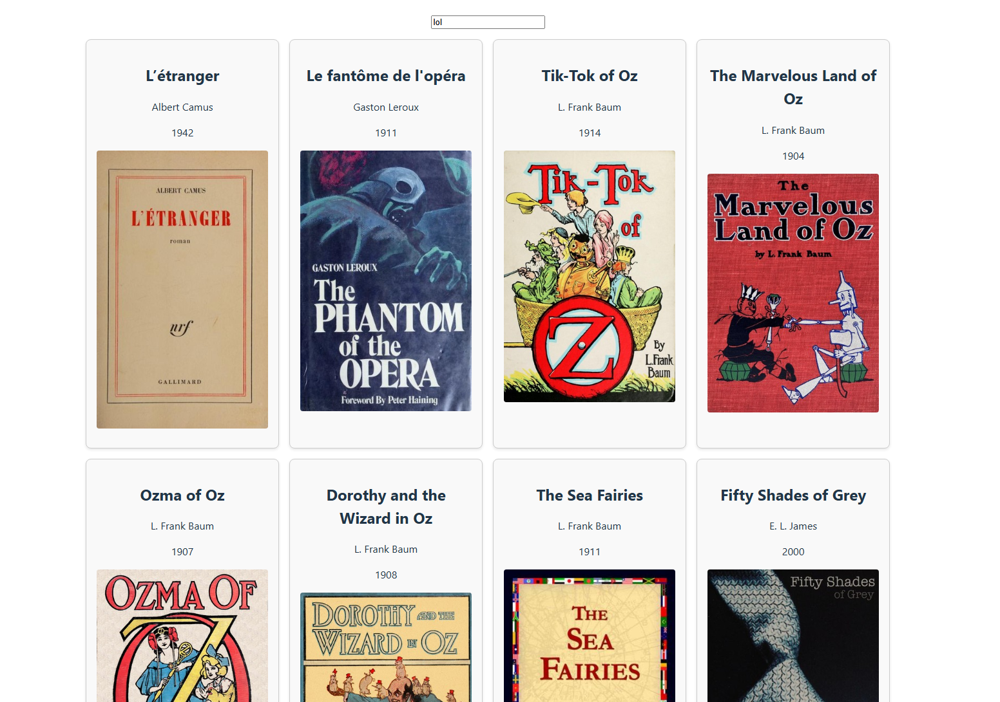

# Book Library Project

The **Book Library Project** is a full-stack web application designed to allow users to search for books and view relevant details such as the title, author, publication year, and cover image. The project is divided into two main components: the **Front-End** and the **Back-End**.

---

## Front-End: `bl-front-end`

The front-end is built using **React**, **TypeScript**, and **Vite**. It provides a responsive and user-friendly interface for users to search for books and view the results in a grid layout.

### Features:
- **Search Functionality**: Users can search for books by entering keywords in the search bar.
- **Dynamic Book Display**: The results are displayed dynamically in a grid format, with each book showing its title, author, publication year, and cover image.
- **Custom Hooks**: The `useFetchBookData` hook is used to fetch book data from the back-end API.
- **Styling**: The application is styled using CSS, ensuring a clean and modern design.

### Key Files:
- `src/App.tsx`: The main component that handles the search input and displays the book data.
- `src/hooks/useFetchBookData.ts`: A custom React hook for fetching book data from the back-end.
- `vite.config.ts`: Configuration for the Vite build tool.
- `.env`: Contains environment variables, such as the back-end URL.

### How to Run:
1. Navigate to the `bl-front-end` directory.
2. Install dependencies using `npm install`.
3. Start the development server with `npm run dev`.
4. Open the application in your browser at `http://localhost:5173`.

---

## Back-End: `back_end`

The back-end is built using **FastAPI**, a modern Python web framework. It serves as the API layer for the application, fetching book data from the Open Library API and transforming it into a format suitable for the front-end.

### Features:
- **API Endpoints**:
    - `/`: A simple root endpoint that returns a "Hello, World" message.
    - `/api/v1/{item_id}`: Fetches book data based on the search query.
- **Data Transformation**: The back-end processes raw data from the Open Library API and converts it into `BookDataDTO` objects.
- **CORS Support**: Configured to allow cross-origin requests from the front-end.

### Key Files:
- `api.py`: The main entry point for the FastAPI application.
- `service/service.py`: Contains the logic for fetching and processing book data.
- `models/book_data_dto.py`: Defines the `BookDataDTO` class for representing book data.

### How to Run:
1. Navigate to the `back_end` directory.
2. Create a virtual environment and activate it:
     ```bash
     python -m venv .venv
     source .venv/bin/activate  # On Windows, use .venv\Scripts\activate
     ```
3. Install dependencies using `pip install -r requirements.txt`.
4. Start the server with:
     ```bash
     uvicorn api:app --reload
     ```
5. The API will be available at `http://127.0.0.1:8000`.

---

## Project Workflow

1. **Search Query**: The user enters a search term in the front-end.
2. **API Request**: The front-end sends a request to the back-end API with the search term.
3. **Data Fetching**: The back-end fetches book data from the Open Library API and processes it.
4. **Response**: The processed data is sent back to the front-end.
5. **Display**: The front-end dynamically displays the book data in a grid layout.

---

## Technologies Used

### Front-End:
- React
- TypeScript
- Vite
- CSS

### Back-End:
- FastAPI
- Python
- HTTPX
- Uvicorn

---

## Future Enhancements
- Add pagination for search results.
- Implement user authentication for personalized features.
- Allow users to save favorite books.
- Enhance error handling and display user-friendly messages.

---

This project demonstrates the integration of modern front-end and back-end technologies to create a seamless user experience. Contributions and feedback are welcome!  